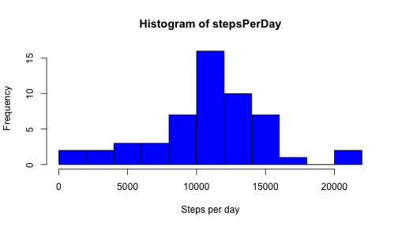

# Reproducible Research: Peer Assessment 1


## Loading and preprocessing the data


```r
library(lubridate)
activity <- read.csv("activity.csv")
```

Lets do some comprobations:

How many NAs we have?


```r
colSums(is.na(activity))
```

```
##    steps     date interval 
##     2304        0        0
```
All of NAs are in the steps column.

How are they distributed?


```r
nasPerDay <- with(activity, tapply(steps, date, function (x) sum(is.na(x))))
barplot(nasPerDay, ylim = c(0, 300))
```

 

It looks like all NAs are distributed in 8 days.


```r
nasPerDay[nasPerDay != 0]
```

```
## 2012-10-01 2012-10-08 2012-11-01 2012-11-04 2012-11-09 2012-11-10 
##        288        288        288        288        288        288 
## 2012-11-14 2012-11-30 
##        288        288
```

This turns important when we calculate the mean and the median, because we don't have any data in those days, we'll just ignore them.

What about the intervals? 
"...This device collects data at 5 minute intervals through out the day..."
So, we should have 288 intervals per day (288 minutes x 5 = 1440 minutes = 24 hours) and the minimum and maximum value should be 0 and 1435 respectively:


```r
numberOfDays <- length(levels(activity$date))
numberOfIntervalsPerDay <- with(activity, tapply(interval, date, length))
correctDays <- length(numberOfIntervalsPerDay[numberOfIntervalsPerDay == 288])
```
We have 61  days and 61 days with 288 intervals.

So each day has 288 intervals, but...


```r
rangeInterval <- range(activity$interval)
```
The range is 0, 2355 which it doesnt make sense for our purposes. Lets plot it:


```r
plot(1:288, as.numeric(levels(factor(activity$interval))), type="l")
```

 

There are regular gaps between several pairs of intervals. Lets fix them with new labels from 0 to 1435:


```r
activity$interval <- factor(activity$interval, labels=seq(0, by=5, length=288))
plot(1:288, as.numeric(levels(activity$interval)), type="l")
```

 

## What is mean total number of steps taken per day?


```r
stepsPerDay <- with(activity, tapply(steps, date, sum))
meanStepsPerDay <- mean(stepsPerDay, na.rm=T)
```
The mean total number of steps taken per day is 1.0766 &times; 10<sup>4</sup>.


```r
medianStepsPerDay <- median(stepsPerDay, na.rm=T)
```
The total median is 10765.

The histogram looks like this:


```r
hist(stepsPerDay, col="blue", breaks=10)
```

 

## What is the average daily activity pattern?


```r
stepsPerInterval <- with(activity, tapply(steps, interval, mean, na.rm=TRUE))
plot(levels(activity$interval), stepsPerInterval, type="l")
```

 


```r
maxStepsPerInterval <- max(stepsPerInterval)
intervalOfmaxSteps <- names(stepsPerInterval[stepsPerInterval == maxStepsPerInterval])
timeOfMaxInterval <- format(Sys.Date() + minutes(intervalOfmaxSteps), "%H:%M")
```
The maximum steps per interval is 206.1698 , which corresponds to the interval 515, at 08:35.


## Imputing missing values

I think it is better to fill NAs with the mean of the interval, that we calculated before:


```r
noNAsActivity <- activity
noNAsActivity$steps <- apply(noNAsActivity, 1, 
	function (x) 
		if (is.na(x["steps"])) 
			as.numeric(stepsPerInterval[x["interval"]]) 
		else 
			as.numeric(x["steps"]))
head(noNAsActivity)
```

```
##     steps       date interval
## 1 1.71698 2012-10-01        0
## 2 0.33962 2012-10-01        5
## 3 0.13208 2012-10-01       10
## 4 0.15094 2012-10-01       15
## 5 0.07547 2012-10-01       20
## 6 2.09434 2012-10-01       25
```

```r
noNAsStepsPerDay <- with(noNAsActivity, tapply(steps, date, sum))
hist(noNAsStepsPerDay, col="green", breaks=10)
```

 


```r
noNAsMean <- mean(noNAsStepsPerDay)
```

The mean is 1.0766 &times; 10<sup>4</sup>, same as before because we have used the average intervals for fill the NAs


## Are there differences in activity patterns between weekdays and weekends?


```r
noNAsActivity$weekday <- wday(ymd(noNAsActivity$date), label=TRUE)
noNAsActivity$week <- sapply(noNAsActivity$weekday,
	function (x)
		if (x %in% c("Sat","Sun"))
			"weekend"
		else
			"weekday"
	)
stepsPerIntervalWeekDay <- with(noNAsActivity[noNAsActivity$week == "weekday",], 
	tapply(steps, interval, mean))
stepsPerIntervalWeekEnd <- with(noNAsActivity[noNAsActivity$week == "weekend",], 
	tapply(steps, interval, mean))
diffstepsInterval <- stepsPerIntervalWeekEnd - stepsPerIntervalWeekDay

plot(levels(noNAsActivity$interval), stepsPerIntervalWeekDay, type="l")
```

 

```r
plot(levels(noNAsActivity$interval), stepsPerIntervalWeekEnd, type="l")
```

 


So... yes, the are differences between weedays and weekends. He/She is more active in weekends :)


